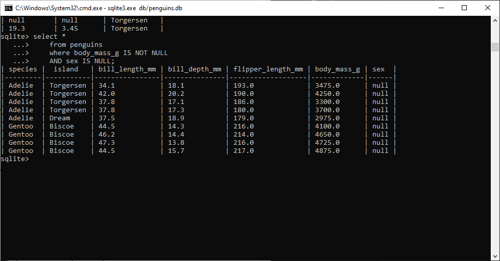

# SQL Exercises - Core Features

## Exercise 1

    Write a SQL query to select the sex and body mass
    columns from the little_penguins in that order,
    sorted such that the largest body mass appears first.

    select
            sex,
            body_mass_g
    from little_penguins
    order by body_mass_g desc;

**Zrzut ekranu:**

## Exercise 2

    Write a SQL query to select the islands and species from rows 50 to 60
    inclusive of the penguins table. Your result should have 11 rows.

    select
            island,
            species
    from penguins
    order by island, species
    limit 10 offset 50;

    Modify your query to select distinct combinations of island and species
    from the same rows and compare the result to what you got in part 1.

    select distinct
            island,
            species
    from penguins
    order by island, species;

**Zrzut ekranu:**

## Exercise 3
    Write a query to select the body masses from penguins that are less
    than 3000.0 grams.

    select
            body_mass_g
    from penguins
    where body_mass_g < 3000

    Write another query to select the species and sex of penguins that
    weight less than 3000.0 grams. This shows that the columns displayed
    and those used in filtering are independent of each other.

    select
            species,
            sex
    from penguins
    where body_mass_g < 3000;

**Zrzut ekranu:**

## Exercise 4

    Use the not operator to select penguins that are not Gentoos.

    select
        species
    from penguins
    where species != 'Gentoos';

    SQL's or is an inclusive or: it succeeds if either or both conditions
    are true. SQL does not provide a specific operator for exclusive
    or, which is true if either but not both conditions are true, but the
    same effect can be achieved using and, or, and not. Write a query to
    select penguins that are female or on Torgersen Island but not both.

    select
        species,
        sex,
        island
    from penguins
    where (sex = 'FEMALE' and island != 'Torgersen') or (sex != 'FEMALE' and island = 'Torgersen');

**Zrzut ekranu:**

## Exercise 5

    Write a single query that calculates and returns:

    1 A column called what_where that has the species and island of each
    penguin separated by a single space.

    2 A column called bill_ratio that has the ratio of bill length to bill
    depth.

    
    select
        species || ' ' || island as what_where,
        bill_length_mm / bill_depth_mm as bill_ratio
    from penguins;

**Zrzut ekranu:**

## Exercise 6

    Use SQLite's .nullvalue command to change the printed
    representation of null to the string null and then re-run
    the previous query. When will displaying null as null be
    easier to understand? When might it be misleading?
    
    Wyświetlanie braku danych jako "null" może ułatwić interpretację danych,
    natomiast może być mylące w sytuacji gdzy w komurce będzie
    wpisana wartość "null" jako string.

**Zrzut ekranu:**

## Exercise 7
    
    1. Write a query to find penguins whose body mass is known but whose sex is not.

    2. Write another query to find penguins whose sex is known but whose body mass is not.

    select *
    from penguins
    where body_mass_g IS NOT NULL
    AND sex IS NULL;

    select *
    from penguins
    where sex IS NOT NULL
    AND body_mass_g IS NULL;

**Zrzut ekranu:**

## Exercise 8
    What is the average body mass of penguins that weight more than 3000.0 grams?
    
    select avg(body_mass_g) as avg_body_mass
    from penguins
    where body_mass_g > 3000.0;

**Zrzut ekranu:**

## Exercise 9
    How many different body masses are in the penguins dataset?
    
    select count(distinct body_mass_g) as unique_body_masses
    from penguins;

**Zrzut ekranu:**

## Exercise-10
    Explain why the output of the previous query has a blank line before the rows for female and male penguins.
    
    Puste miejce przy poprzednim pytaniu wynika z faktu że istnieją wiersze w których płeć posiada wartość NULL, ta jest wyświetlana  domyślnie jako puste pole.
    
    Write a query that shows each distinct body mass in the penguin dataset and the number of penguins that weigh that much.
    
    select body_mass_g, count(*) as count
    from penguins
    where body_mass_g is not NULL
    group by body_mass_g
    order by body_mass_g;

**Zrzut ekranu:**

## Exercise 11
    Write a query that uses filter to calculate the average body masses of heavy
    penguins (those over 4500 grams) and light penguins (those under 3500 grams)
    simultaneously. Is it possible to do this using where instead of filter?
    
    select
        avg(body_mass_g) filter (where body_mass_g > 4500) as avg_heavy,
        avg(body_mass_g) filter (where body_mass_g < 3500) as avg_light
    from penguins;
    
    przy pomocy podzapytań można osiągnąć identyczny efekt bez użycia filter
    
    select
        (select avg(body_mass_g) from penguins where body_mass_g > 4500) as avg_heavy,
        (select avg(body_mass_g) from penguins where body_mass_g < 3500) as avg_light;

**Zrzut ekranu:**

## Exercise 12
    Using an in-memory database, define a table called notes with two text
    columns author and note and then add three or four rows. Use a query
    to check that the notes have been stored and that you can (for example)
    select by author name.
    
    What happens if you try to insert too many or too few values into notes?
    What happens if you insert a number instead of a string into the note
    field?
    
    create table notes (
        author text,
        note text
    );
    
    insert into notes values
    ('Jozef', 'Narod wspanialy, tylko ludzie kurwy'),
    ('Jozef', 'Kto nie byl za mlodu socjalista ten na starosc bedzie skurwysynem'),
    ('Jozef', 'Zdanie jest jak dupa, kazdy ma swoja');
    
    Próba wpisania niewałściwej liczby wartości do tabeli poskutkuje błędem i nie dodaniem ich do bazy danych.
    Podanie liczby zamiast tekstu nie wyrzuci błędu i baza będzei działać nadal poprawnie.

**Zrzut ekranu:**

## Exercise 13
    What happens if you try to delete rows that don't exist
    (e.g., all entries in work that refer to juna)?
    
    Polecenie sie wykona bez zwracania błędów, po prostu nie usunie nic bo żaden wiersz nie spełni kryteriów.

**Zrzut ekranu:**

## Exercise 14
    Saving and restoring data as text:

    1. Re-create the notes table in an in-memory database and then use
    SQLite's .output and .dump commands to save the database to a
    file called notes.sql. Inspect the contents of this file: how
    has your data been stored?

    2. Start a fresh SQLite session and load notes.sql using the .read
    command. Inspect the database using .schema and select *: is
    everything as you expected?

    .output notes.sql
    .dump
    .read notes.sql

    Saving and restoring data in binary format:

    1. Re-create the notes table in an in-memory database once again
    and use SQLite's .backup command to save it to a file
    called notes.db. Inspect this file using od -c notes.db or a text
    editor that can handle binary data: how has your data been stored?

    2. Start a fresh SQLite session and load notes.db using the .restore
    command. Inspect the database using .schema and select *: is
    everything as you expected?

    .backup notes.db
    
    Plik zawiera w sobie polecenia tworzące tabele a nastepnie dane
    wierszy zapisane w odwrotnej kolejności

    po inporcie wszystko jest ok

**Zrzut ekranu:**

## Exercise 15
    Re-run the query shown above using where job = name
    instead of the full table.name notation. Is the shortened
    form easier or harder to read and more or less likely to cause errors?
    
    Użycie skróconej formy WHERE job = name działa, ale jest trudniejsze do czytania oraz bardziej podatne na błędy, szczególnie gdy kolumny o tych nazwach istnieją w obu tabelach lub gdy zapytania stają się bardziej złożone.

**Zrzut ekranu:**

## Exercise 16
    Find the least time each person spent on any job. Your output should
    show that mik and po each spent 0.5 hours on some job. Can you
    find a way to show the name of the job as well using the SQL you have
    seen so far?
    
    select work.person, MIN(job.billable), job.name
    from work join job on work.job = job.name
    group by work.person

**Zrzut ekranu:**

